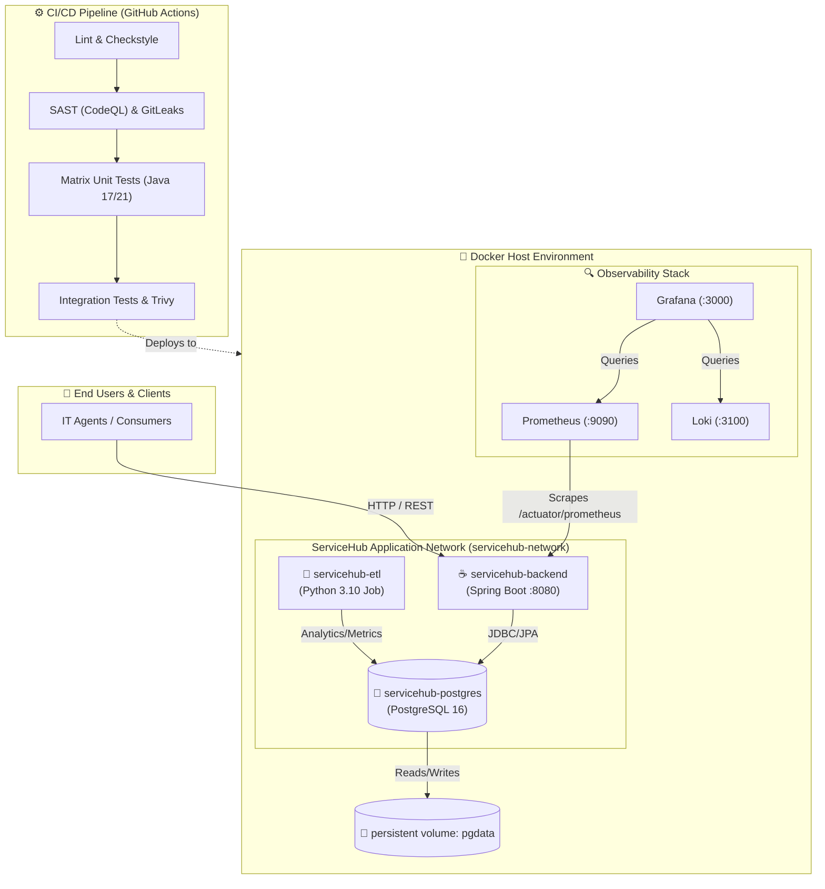

# ServiceHub — Internal Service Request System

<div align="center">
  
  
  
  
</div>

<br/>

An internal service request management platform with intelligent routing, SLA tracking, and workflow automation. Built by Team 10.

## 🏛️ Architecture Overview



## 🚀 Quick Start (DevOps Starter Kit)

This repository has been fully configured with an industry-standard DevOps setup to make your development process as smooth as possible.

**Prerequisites:** Docker Desktop and Git.

```bash
# 1. Clone the repo
git clone <your-repo-url>
cd 4-ServiceHub

# 2. Setup your local environment file
cp .env.example .env

# 3. Start the application stack (Backend, Postgres, Data Pipeline)
docker-compose up --build
```

- **Application UI**: [http://localhost:8080](http://localhost:8080)
- **API Documentation**: [http://localhost:8080/swagger-ui.html](http://localhost:8080/swagger-ui.html)
- **Health Check**: [http://localhost:8080/actuator/health](http://localhost:8080/actuator/health)

### Default Users
| Role | Email | Password |
|------|-------|----------|
| ADMIN | admin@amalitech.com | password123 |
| AGENT | agent@amalitech.com | password123 |
| USER | user@amalitech.com | password123 |

---

## 📚 Project Documentation

We have comprehensive documentation in the `docs/` folder to help you get started:

- [🏁 Getting Started Guide](docs/getting-started.md) — Detailed setup steps
- [🏛️ Architecture Overview](docs/architecture.md) — System design and tech stack
- [🌿 Branching Strategy](docs/branching-strategy.md) — How we use Git and write commit messages

### 👨‍💻 Role-Specific Developer Guides

Every team member has a specific guide detailing their deliverables, files they own, and code coordination points:

- [Backend Dev A: Request Management](docs/developer-guides/backend-dev-a-request-management.md) (@ange-buhendwa)
- [Backend Dev B: Workflow & SLA](docs/developer-guides/backend-dev-b-workflow-sla.md) (@fiifi-yawson)
- [Backend Dev C: Auth & Dashboard](docs/developer-guides/backend-dev-c-auth-dashboard.md) (@alphonse-shema)
- [QA Engineer](docs/developer-guides/qa-engineer.md) (@zakaria-osman)
- [Data Engineer](docs/developer-guides/data-engineer.md) (@richard-sarfo)
- [DevOps Engineer](docs/developer-guides/devops-engineer.md) (@prince-ayiku)

---

## 🛠️ DevOps Features Included

* **One-Click Local Dev:** `docker-compose up` runs the DB, Backend, and ETL pipeline.
* **Environment Profiles:** `application-dev.yml`, `application-test.yml`, and `application-prod.yml` separate configurations cleanly and ensure secrets are never hardcoded.
* **Automated CI/CD:** GitHub Actions automatically build, test, and scan code on every Pull Request.
* **Code Quality Guards:** `.pre-commit-config.yaml` catches secrets, bad branch names, and invalid commit messages before they leave your machine.
* **Code Owners:** `.github/CODEOWNERS` automatically requests PR reviews from the right team members.
* **Observability:** Structured JSON logging (`logback-spring.xml`) and Prometheus metrics ready to go.

### Helpful Commands

We use a `Makefile` to simplify common tasks:

```bash
make up         # Start all services
make down       # Stop all services
make logs       # Tail backend logs
make db-shell   # Connect to PostgreSQL shell
make clean      # Destroy containers and database volumes (start fresh)
```

### CI/CD Overview

This repository uses GitHub Actions with **modular, reusable workflows**:

- Feature branches run a fast CI (`.github/workflows/ci-feature.yml`) that only executes the stages affected by the files you changed (backend, data-engineering, or devops), plus a mandatory GitLeaks scan.
- The main CI on `develop` (`.github/workflows/ci.yml`) orchestrates reusable workflows for:
  - Backend lint & tests
  - Data-engineering lint
  - DevOps YAML lint
  - Backend Docker image build
  - Security scans (GitLeaks + Trivy image scan)
  - Integration smoke test against PostgreSQL

Logs are grouped for readability and a single image artifact is built and scanned **before any push to a registry (ECR/GHCR)**.
