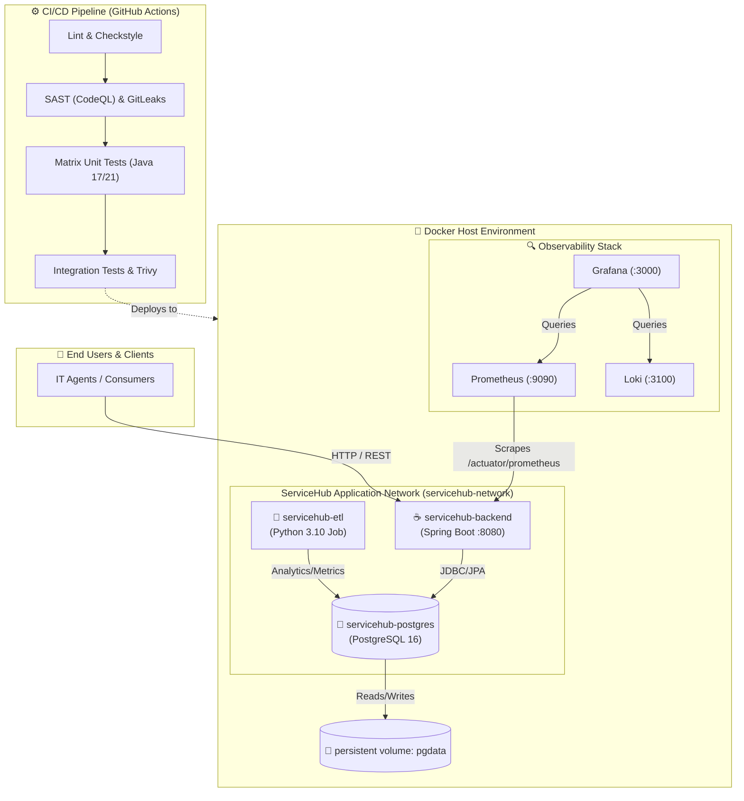

# ServiceHub Architecture Diagram Prompt

Use this prompt with an AI image generation agent (e.g., DALL·E, Midjourney, or diagram tools like Excalidraw AI) to create a professional AWS/Docker cloud architecture diagram for the ServiceHub application.

---

## Prompt for AI Image Generation (copy and paste)

```text
Create a professional cloud architecture diagram titled "ServiceHub IT Service Management Architecture"

CRITICAL: The App Server (Docker Host) runs exactly THREE core containers plus an Observability stack. All containers must be clearly visible inside the Host box:
1. servicehub-backend (Spring Boot Java 17 API)
2. servicehub-db (PostgreSQL 16)
3. servicehub-etl (Python Data Engineering Pipeline)

LAYOUT (16:9 Landscape, White/Light Background):

TOP-LEFT EXTERNAL COLUMN (Gray Box "DevOps Pipeline"):
├── GitHub Logo → "Source Control"
├── GitHub Actions Logo → "CI/CD Gatekeeper"
│   ├── CodeQL (SAST)
│   ├── GitLeaks (Secrets)
│   ├── Trivy (Container Scan)
│   └── JDK 17 & 21 Matrix Builds
└── Arrow labeled "Git Merge" pointing right

TOP FLOW (Client Entry):
[👤 Users / IT Agents] → "HTTP (8080)" → [🌐 Internet] → [Host Machine Firewall]
                                              ↓
                        [Docker Host / EC2 Instance - Ubuntu]
                                              ↓
                    ┌─────────────────────────┴─────────────────────────┐
                    ↓                                                   ↓
          [servicehub-backend container]                        [Prometheus container]
          Spring Boot 3.2 API :8080                             Prometheus :9090
          (Handles JWT Auth, SLA Logic)                                 ↓
                    ↓                                                   ↓
      [servicehub-network (isolated)]                     [Grafana container :3000]
                    ↓
          [servicehub-db container]
          PostgreSQL 16 :5432
          (Persistent Volume: pgdata)
                    ↑
          [servicehub-etl container]
          Python Data Engineering Job
          (Extracts tickets, computes metrics)

CENTER (Docker Host - Light Blue Box with Docker Logo):
┌─────────────────────────────────────────────────────────────────────────┐
│  Docker Host / EC2 Instance                                             │
│  Bootstrap: docker-compose.yml + docker-compose.observability.yml       │
│                                                                         │
│  ┌───────────────────────────────────────────────────────────────────┐ │
│  │  ServiceHub App Stack - servicehub-network                          │ │
│  │                                                                   │ │
│  │  ┌────────────────────┐                 ┌────────────────────┐    │ │
│  │  │ servicehub-backend │                 │ servicehub-etl     │    │ │
│  │  │ Java 17 :8080      │                 │ Python 3.10        │    │ │
│  │  └─────────┬──────────┘                 └─────────┬──────────┘    │ │
│  │            │                                      │               │ │
│  │            │         [Internal Bridge Network]    │               │ │
│  │            │                                      │               │ │
│  │            └──────────────────┐  ┌────────────────┘               │ │
│  │                               ▼  ▼                                │ │
│  │                       ┌─────────────────┐                         │ │
│  │                       │ servicehub-db   │                         │ │
│  │                       │ PostgreSQL :5432│                         │ │
│  │                       └───────┬─────────┘                         │ │
│  │                               │ (Persistent Volume)               │ │
│  │                            [pgdata]                               │ │
│  └───────────────────────────────────────────────────────────────────┘ │
│                                                                         │
│  ┌───────────────────────────────────────────────────────────────────┐ │
│  │  Observability Stack (Metrics & Logs)                               │ │
│  │  ┌────────────┐   ┌────────────┐   ┌────────────┐                 │ │
│  │  │ Prometheus │──▶│  Grafana   │   │   Loki     │                 │ │
│  │  │ :9090      │   │  :3000     │   │   :3100    │                 │ │
│  │  └────────────┘   └────────────┘   └────────────┘                 │ │
│  └───────────────────────────────────────────────────────────────────┘ │
└─────────────────────────────────────────────────────────────────────────┘

BOTTOM-LEFT (Infrastructure / Infrastructure as Code):
┌─────────────────────────────────────────────────────────────────┐
│  Infrastructure & Config                                        │
│                                                                 │
│  [Docker Icon]              [Config Files]                      │
│  Docker Compose             application-dev.yml                 │
│  Internal DNS               application-test.yml                │
│  bridge networks            application-prod.yml                │
└─────────────────────────────────────────────────────────────────┘

BOTTOM-RIGHT (Secrets & Auth - Gray Box):
┌─────────────────────────────────────────┐
│  Secrets & Authentication               │
│                                         │
│  [Secrets Manager Icon]                 │
│  DB_USERNAME, DB_PASSWORD, DB_NAME      │
│  JWT_SECRET (Env Variables)             │
│                                         │
│  [Shield Icon]                          │
│  No hardcoded secrets (detect-secrets)  │
└─────────────────────────────────────────┘

NETWORK FLOW ANNOTATIONS:
- "servicehub-network": Bridge connecting backend, ETL, and DB.
- Traffic constraint: DB and ETL are totally isolated from the internet (no published ports by default, aside from mapped local dev ports).
- Prometheus scrapes `/actuator/prometheus` on the backend container.

STYLING:
- Official Docker Blue (#2496ED) for Container borders.
- Spring Green (#6DB33F) for the backend API block.
- PostgreSQL Blue (#336791) for the database block.
- Python Blue/Yellow for the ETL block.
- Section backgrounds: Host=light blue (#E8F4F8), CI/CD=light green (#E8F5E9), Secrets=light gray.
- Clean sans-serif font, subtle shadows on boxes, 2px rounded borders.
```

---

## Direct Markdown Output (Mermaid Diagram)

If the AI image generation fails or isn't perfect, you can drop this Mermaid diagram directly into your `README.md` or architecture documentation!


**Alternative Flowchart Mermaid (Best for Readme display):**


